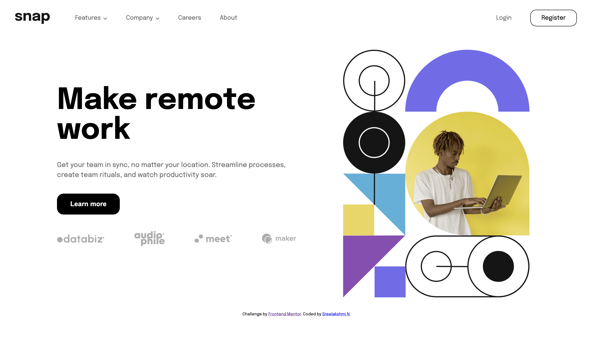
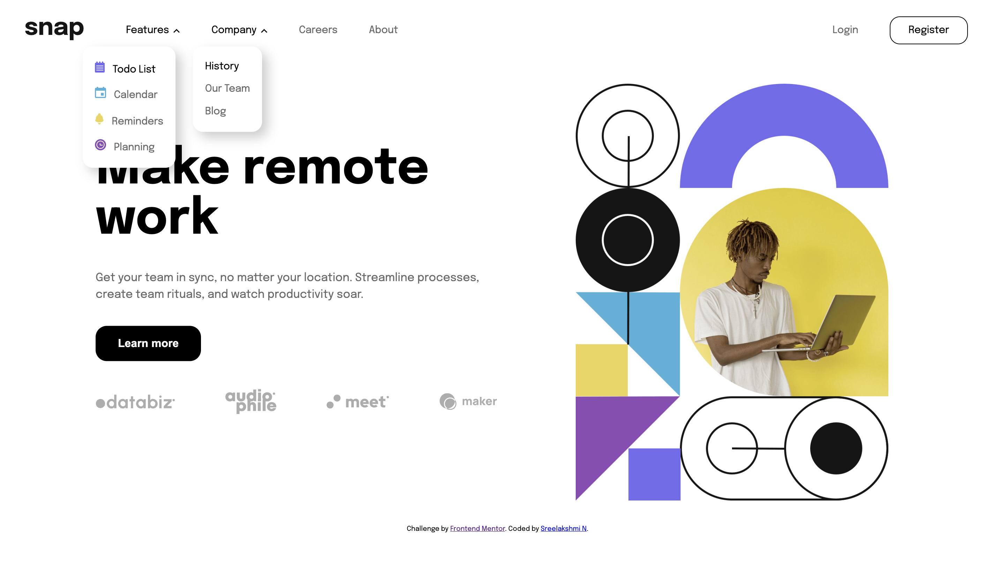
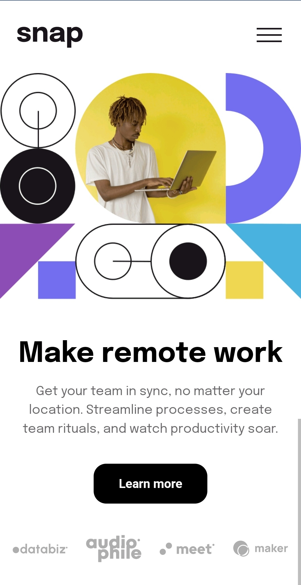
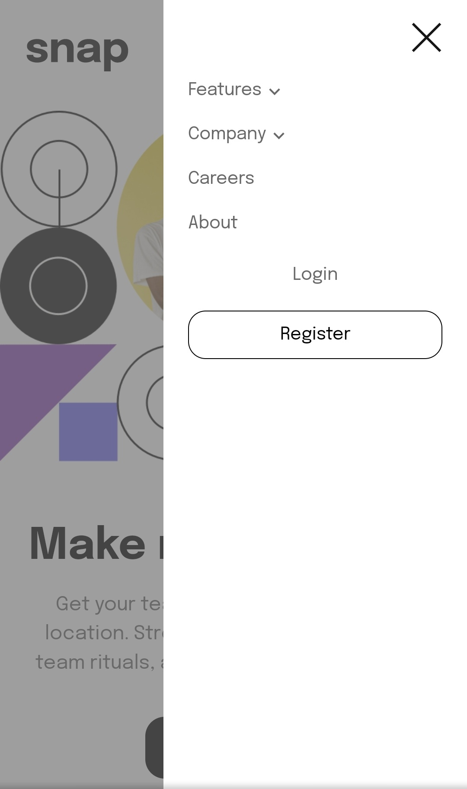
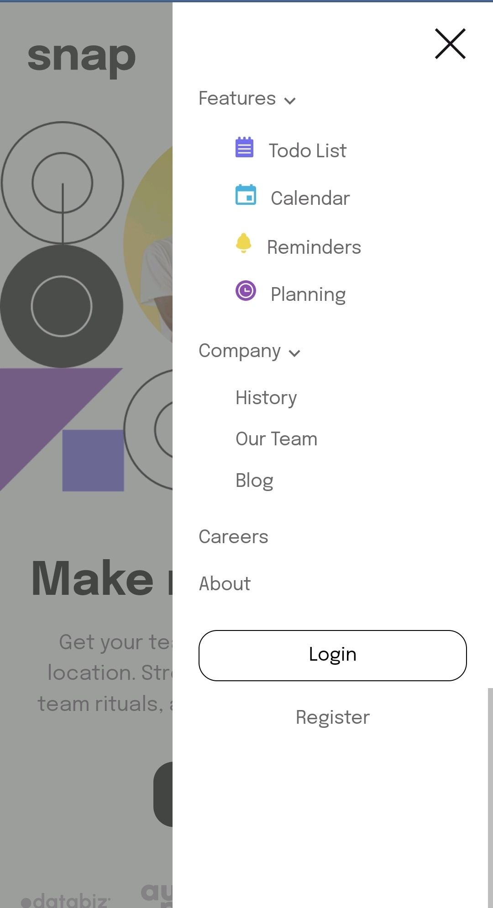

# Frontend Mentor - Intro section with dropdown navigation solution

This is a solution to the [Intro section with dropdown navigation challenge on Frontend Mentor](https://www.frontendmentor.io/challenges/intro-section-with-dropdown-navigation-ryaPetHE5).

## Table of contents

- [Overview](#overview)
  - [The challenge](#the-challenge)
  - [Screenshot](#screenshot)
  - [Links](#links)
- [My process](#my-process)
  - [Built with](#built-with)
  - [What I learned](#what-i-learned)
  - [Continued development](#continued-development)
  - [Useful resources](#useful-resources)
- [Author](#author)
- [Acknowledgments](#acknowledgments)

## Overview

### The challenge

Users should be able to:

- View the relevant dropdown menus on desktop and mobile when interacting with the navigation links
- View the optimal layout for the content depending on their device's screen size
- See hover states for all interactive elements on the page

### Screenshot

#### Desktop Version



#### Desktop Active State



#### Mobile Version and Active State

<p>
&nbsp;&nbsp;&nbsp;&nbsp;&nbsp;&nbsp;&nbsp;&nbsp;&nbsp;&nbsp;&nbsp;&nbsp;&nbsp;&nbsp;&nbsp;&nbsp;&nbsp;&nbsp;&nbsp;&nbsp;

</p>

#### Mobile Menu Collapsed and Expanded

<p>
  &nbsp;&nbsp;&nbsp;&nbsp;&nbsp;&nbsp;&nbsp;&nbsp;&nbsp;&nbsp;&nbsp;&nbsp;&nbsp;&nbsp;&nbsp;&nbsp;&nbsp;&nbsp;&nbsp;&nbsp;
  
</p>

### Links

- [Solution URL](https://github.com/sree-lakshmi-n/intro-section-with-dropdown-navigation)
- [Live site URL](https://sree-lakshmi-n.github.io/intro-section-with-dropdown-navigation)

## My process

### Built with

- Semantic HTML5 markup
- CSS custom properties
- Flexbox
- Vanilla JS

#### Development tool used

- Visual Studio Code

### What I learned

Some of my major learnings while working through this project.

1. Clearing floats

```css
.clearfix::after {
  content: "";
  clear: both;
  display: table;
}
```

2. Centering a div in another div

```css
.center {
  position: absolute;
  top: 50%;
  left: 50%;
  transform: translate(-50%, -50%);
}
```

3. Using media query in JS

```js
let mediaQuery = window.matchMedia("(max-width: 820px)");
mediaQuery.addEventListener("change", checkMediaQuery);
```

### Continued development

To improve functionality of this page. To redirect the clickable links to other pages.

### Useful resources

- [Stack Overflow](https://stackoverflow.com/questions)
- [CSS tricks - Flexbox](https://css-tricks.com/snippets/css/a-guide-to-flexbox)
- [CSS tricks - Working with JavaScript Media Queries](https://css-tricks.com/working-with-javascript-media-queries)
- [MDN - CSS Reference](https://developer.mozilla.org/en-US/docs/Web/CSS/Reference)
- [MDN - JavaScript Reference](https://developer.mozilla.org/en-US/docs/Web/JavaScript/Reference)
- [Google Fonts](https://fonts.google.com)
- [W3C HTML Validator](https://validator.w3.org)

## Author

- Frontend Mentor - [@yourusername](https://www.frontendmentor.io/profile/yourusername)
